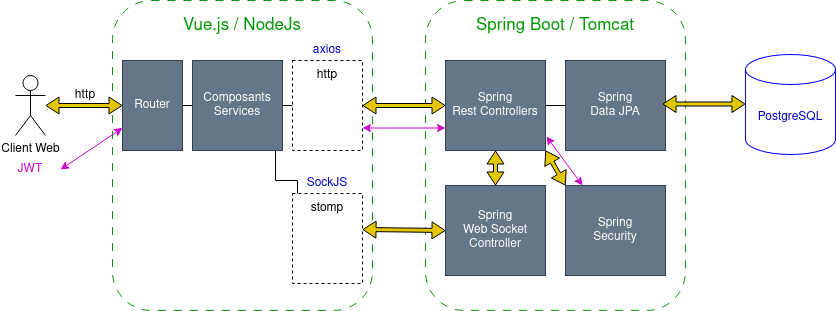

# Projet d'Application Web

Projet fullstack d'une application web dans le cadre de nos cours à l'ENSEEIHT. Elle est constituée d'une application VueJS et d'une API REST avec Spring Boot.

## Fonctionnalités, technologies et architecture

Toutes les informations techniques sont décrites dans notre [rapport](rapport_app_web.pdf).

## Développement

Voir [CONTRIBUTING.md](CONTRIBUTING.md).

## Auteurs

- [Cyrian Ragot](https://github.com/cyrianR)
- [Nino Rottier](https://github.com/steno3)
- [Timothée Klein](https://github.com/pekatour)
- [Marwa El Omari](https://github.com/marwa-elomari)
- [Baptiste Arrix-Pouget]()
